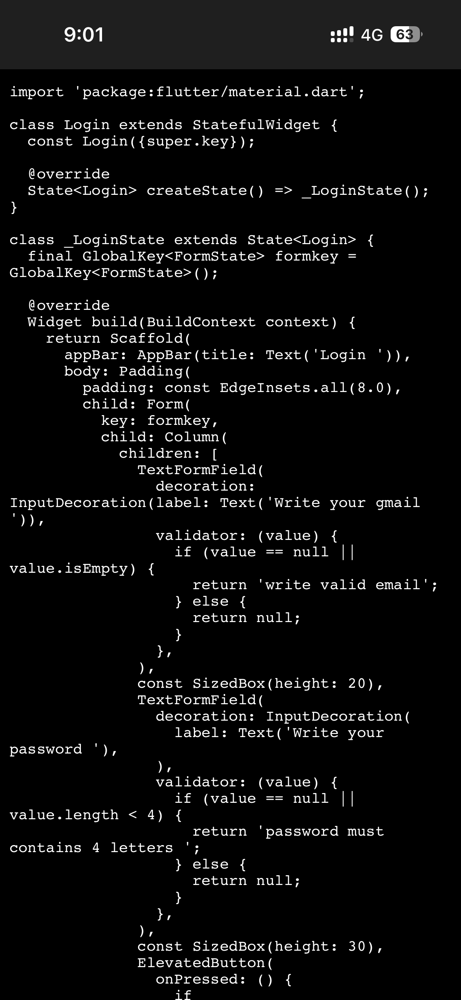
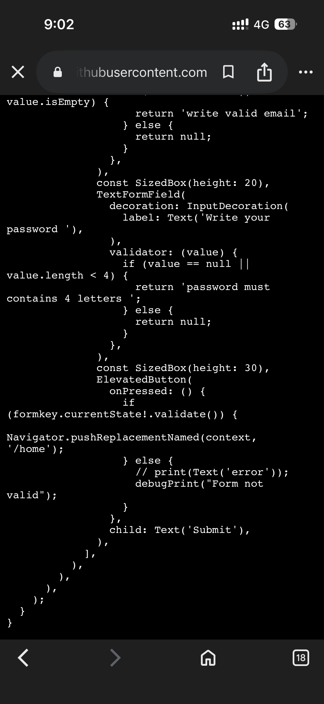
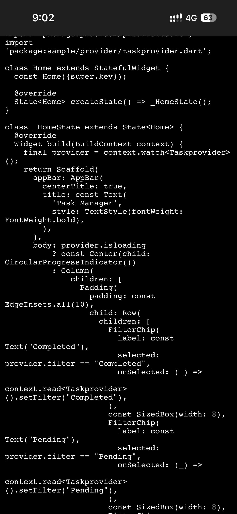

}
# Task Manager Flutter App

A simple Flutter Task Manager application built using Provider state management and REST API.

## Features
- Fetch tasks from API
- Display tasks in ListView
- Filter tasks (Completed / Pending / All)
- Clean architecture (Provider + Services + Model)

## Tech Used
- Flutter
- Provider (State Management)
- REST API
- MVC structure

## API Used
https://jsonplaceholder.typicode.com/todos
## App Screenshots

### Login Screen

### Home Screen

### Filtered View

## Author
Abhi Thakur
